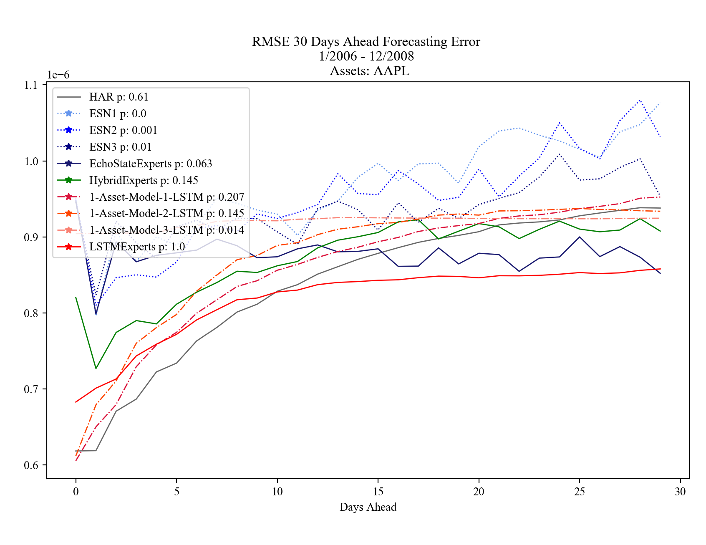
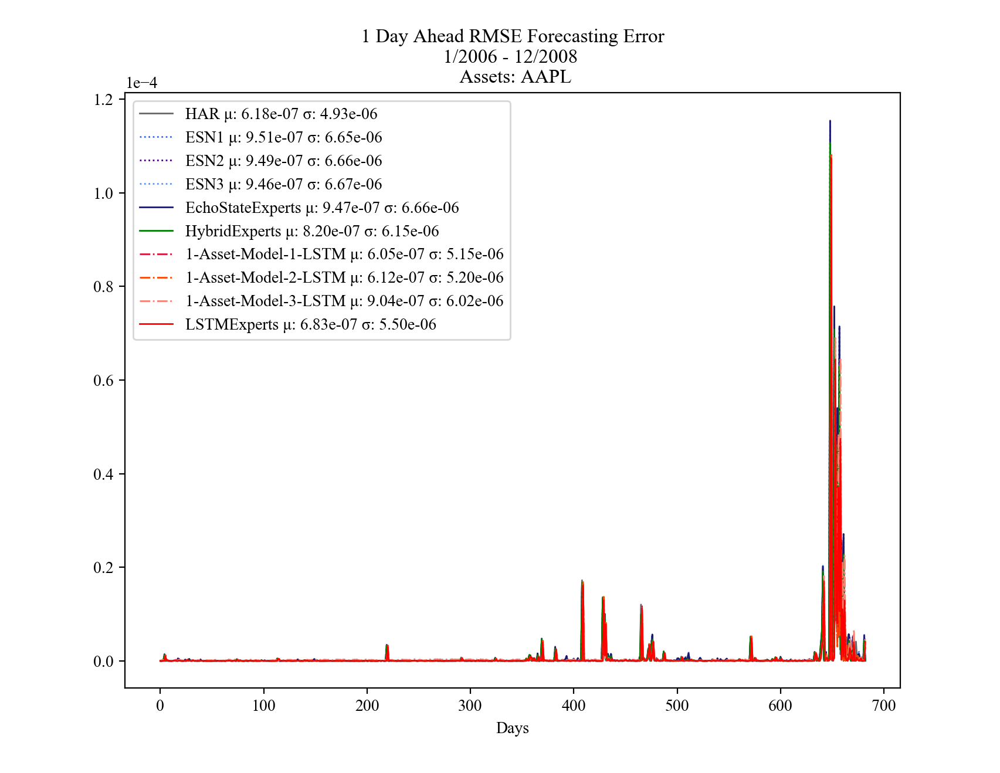

## Master Thesis Forecasting Realized Covariance Matrices with LSTM and Echo State Networks
### Code Appendix

  

  

### Requirements:
Python 3.6.9

* [Tensorflow](https://www.tensorflow.org/) 2.0.0
* [Sklearn](https://scikit-learn.org/stable/) 0.21.3
* [Pandas](https://pandas.pydata.org/) 0.25.2
* [Matplotlib](https://matplotlib.org/) 3.1.1
* [Scipy](https://www.scipy.org/) 1.3.1
* [Bayesian Optimization](https://github.com/fmfn/BayesianOptimization) 1.1.0
* [Numpy](https://numpy.org/) 1.17.2
* [arch](https://github.com/bashtage/arch) 4.13

The code was formatted using [Black](https://github.com/psf/black)
