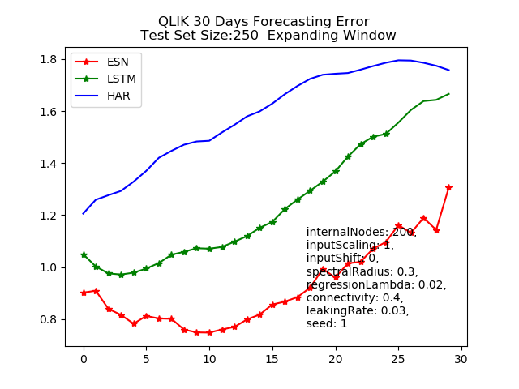

## Forecasting Realized Covariance Matrices with LSTM and Echo State Networks (Work in Progress)
Master Thesis Lukas Schreiner

### 1.1 Models Univariate 

* LSTM
    - 32 LSTM Cells, 1 Layer
    - Adam Optimizer
    - Gradient Clipping at 0.5
    - Dropout = 0.01
    - Regularization = 0.001
    - Activation Functions: Relu
    - 5000 training epochs with early stopping
* Echo State Network
    - internalNodes : 100 
    - spectralRadius': 0.17
    - regressionLambda': 1.0
    - connectivity': 0.011
    - leakingRate': 0.08
* Univariate HAR

### 2.1 Results Univariate 

#### RMSE Error Measure

  

#### QLIK Error Measure

  

### L1 Norm Error Measure

  

### 3. Data
Oxford-Man Institute of Quantitative Finance
Dataset can be found [here](https://realized.oxford-man.ox.ac.uk)